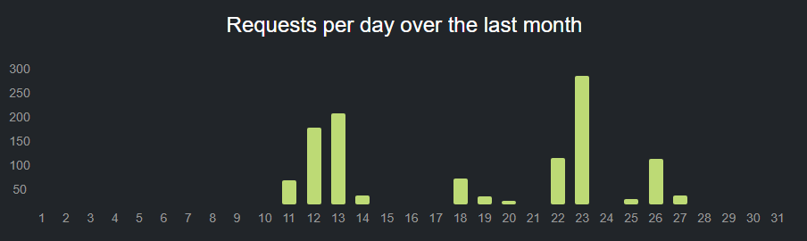
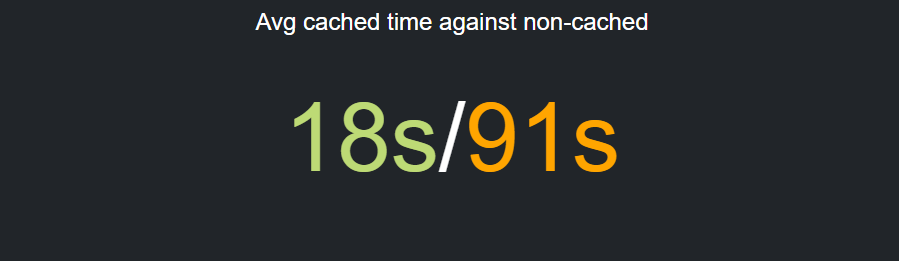
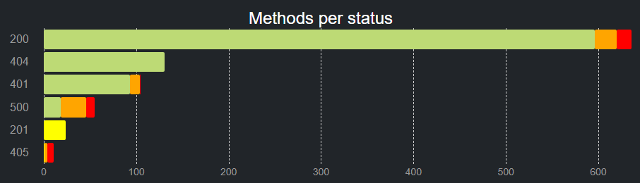
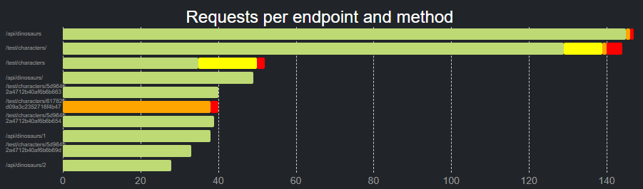

# PteroView

## Getting Started:
- Fork and clone this repo.
- Then use the following commands to run the application:

| Commands |                                             |
| -------  | ------------------------------------------- |
|  Install |  <code>npm install</code>                   |
|  Develop |  <code>npm run dev</code>                   |
|  Develop |  <code>npm run dev:svelte</code>            |
|  Build   |  <code>npm run build</code>                 |


To get started on PteroView make sure the server that hosts your log data is running, then simply install and open the PteroView app. There you will be greated by the opening page, go into settings and paste in the URI to your log stream. At this point you should be able to edit certain settings in the setting page including refresh rate as well as a manual refresh button. 

From here you can see the graphs page as well as the home page to see a variaty of graphs and statistics about your logs. The logs themselves can be find under the log tab.

## Metrics 
Following model is all the information that is collected with the Ptero Deno module.
```js 
interface LogSchema {
  _id: { $oid: string },
  method: string,
  route: string,
  timeAccessed: Date,
  status: string,
  responseTime: string,
  APIKey: string,
  ipAddress: string,
  fromCache: boolean,
}
```
### Requests per day over the last month
- It is a vertical line graph that shows how many requests were made to the API depending on the day of the month.



### Avg cached time against non-cached
- Simple GUI that shows the average time of the data retrieved from cache verses the average time of the data pulled from the server.



### Methods per status
- It is a horizontal line graph that shows what type of methods executed with different status codes differentiated by color.



### Requests per endpoint and method
- It is a horizontal line graph that shows what type of methods were requested to the different endpoint of the API's.


 
### More to Come!
- The open source nature of our project means that new visualizations can be added using the data already collected from the Ptero module. Including user metrics, cached statistics, and usage over time!
